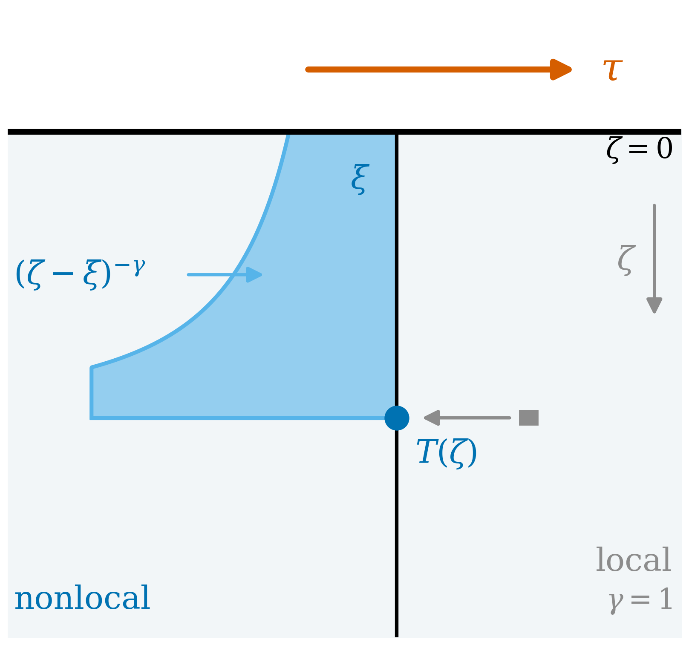

# Supplementary Scripts: **An exactly solvable Ekman layer with a fractional-order stress closure**

[](https://www.python.org)
[](https://numpy.org)
[](https://scipy.org)
[](https://mpmath.org)
[](https://matplotlib.org)
[](https://peps.python.org/pep-0008/)
[](https://peps.python.org/pep-0257/)
[](LICENSE)
[](#)

Supplementary code for a wind-driven boundary layer closed by a fractional-order
flux-gradient law instead of a local eddy viscosity. 

<div align="center">
  
</div>

## Model

On an $f$-plane, with $\zeta=-z$ the depth, $\psi=u+iv$ and $T=T_x+iT_y$, the
closure-free momentum balance is

$$i f \rho\,\psi = -\partial_\zeta T, \qquad T(0)=\tau, \qquad T(\infty)=0,$$

which alone gives the Ekman transport $\int_0^\infty\psi\,d\zeta=-i\tau/(\rho f)$
for any closure. The local law $T=-\rho K\partial_\zeta\psi$ is replaced by a
Scott-Blair law of order $\gamma$,

$$T = -\rho K_\gamma\,{}^{C}\!D^{\gamma}_{\zeta}\psi, \qquad 0<\gamma\leq1,$$

so the stress at depth depends on a power-law-weighted history of the shear
over the column above. Setting $\gamma=1$ recovers Ekman exactly.

## Results

**The obvious formulation is ill posed.** A Caputo derivative based at the
surface satisfies ${}^{C}\!D^{\gamma}_{\zeta}\psi = O(\zeta^{1-\gamma})\to0$,
so the closure forces $T(0)=0$ and the wind stress cannot be imposed on $\psi$.
Riemann-Liouville gives a $\zeta^{-\gamma}$ divergence instead. The problem must
be posed on the stress, which exchanges the boundary datum and the unknown.

**Posed on the stress, it is exactly solvable.** With $\mu=1+\gamma$,
$b=if/K_\gamma$, and $p_0=b^{1/\mu}$ the right-half-plane root that
$T(\infty)=0$ cancels,

$$\hat T(p) = \tau\,\frac{p^{\gamma-1}(p-p_{0})}{p^{\mu}-b},
\qquad \psi(0)=\frac{\tau p_{0}}{i f \rho},$$

$$T(\zeta)=\tau\left[E_{\mu,1}(b\zeta^{\mu})-p_{0}\zeta E_{\mu,2}(b\zeta^{\mu})\right].$$

**Deflection angle.** $\theta(\gamma)=-\tfrac{\pi}{2}\gamma/(1+\gamma)$, exact,
$-45^\circ$ at $\gamma=1$, and below it otherwise.

**Algebraic far field.** $T\sim A_\gamma\zeta^{-\gamma}$ with
$A_\gamma=\tau(p_0/b)/\Gamma(1-\gamma)$, so $|\psi|\sim\zeta^{-(1+\gamma)}$.
The factor $1/\Gamma(1-\gamma)$ vanishes at $\gamma=1$, removing the tail and
making the classical limit singular.

**Quarter turn, modulo $2\pi$.** The deep direction is
$\arg\psi(\infty)=\pi/(2\mu)-\pi$, so

$$\arg\psi(\infty)-\arg\psi(0)=-\tfrac{\pi}{2} \pmod{2\pi}$$

at every $\gamma<1$. The net turning is $-\tfrac{\pi}{2}-2\pi n$, where the
winding number $n$ is measured, not derived: $n=0$ up to $\gamma\simeq0.90$,
$n=1$ to $\gamma\simeq0.995$, $n\geq2$ by $0.999$, diverging as $\gamma\to1$.

**Spin-up.** Transforming in time sends $if\to\sigma+if$, and the surface
transform inverts exactly:

$$\psi(0,t)=\psi(0,\infty)\,P\!\left(a,ift\right), \qquad a=\frac{\gamma}{1+\gamma},$$

with $P$ the regularized lower incomplete gamma function and $a$ the same
combination that fixes $\theta$. At $\gamma=1$ this is $\mathrm{erf}(\sqrt{ift})$.
The transient envelope decays as $(ft)^{-1/(1+\gamma)}$, never exponentially.

## Numerics

Three algorithms, no shared code path: fixed-Talbot contour inversion of the
depth transform (rewritten for complex-valued inverses, since the usual
real-part shortcut assumes a symmetry absent here), arbitrary-precision
Mittag-Leffler summation, and product-integration marching of the equivalent
Volterra system. The public solution splices series below $\zeta=0.05$ and
contour above; cross-method agreement is reported on the contour branch alone.

| check | result |
| --- | --- |
| deflection angle vs closed form | $1.1\times10^{-14}$ deg |
| contour vs series, $0.25<\zeta<16$ | $6.9\times10^{-10}$ |
| tail amplitude at $\zeta=10^{5}$, relative | $3.2\times10^{-5}$ |
| product-integration order, $\gamma=0.3\ldots0.9$ | 1.294, 1.483, 1.658, 1.803 |
| predicted $\min(2,1+\gamma)$ | 1.300, 1.500, 1.700, 1.900 |
| transport invariant, both paths, relative | $<10^{-9}$ |
| spin-up vs quadrature, $ft\leq400$, relative | $1.2\times10^{-11}$ |
| classical limit vs $\mathrm{erf}(\sqrt{ift})$ | $1.6\times10^{-15}$ |
| net turning modulo $360^\circ$, residual | $<0.01^\circ$ for $\gamma\geq0.6$ |

## Units

Everything plotted and tabulated is dimensionless. The reference case is
$f=K_\gamma=\rho=\tau=1$, so $\delta_\gamma=(K_\gamma/f)^{1/(1+\gamma)}=1$ and
the problem depends on $\gamma$ alone.

One caveat governs comparison across the family. $K_\gamma$ carries units
$\mathrm{m}^{1+\gamma}\mathrm{s}^{-1}$ and is a dimensionally different quantity
at each $\gamma$, so $K_\gamma=1$ does not fix a common physical mixing
strength. Comparable across $\gamma$, because independent of $K_\gamma$: the
angles, the winding number, the exponents $1+\gamma$ and $a$, and every ratio
against $\zeta/\delta_\gamma$. Not comparable: $\delta_\gamma$ in metres and
absolute speeds. None of the latter is reported anywhere.

## Run

```bash
pip install -r requirements.txt   # or: pip install -e .
python scripts/run_all.py
```

About three minutes. Figure scripts also run standalone. Lint with
`pycodestyle bayu/ scripts/` and `pydocstyle bayu/ scripts/`; both report
nothing.

## Layout

```
bayu/
  core.py           parameters, characteristic root, closed forms
  transform.py      fixed-Talbot inversion, complex-valued, full contour
  mittagleffler.py  arbitrary-precision E_{mu,nu} and the series solution
  solution.py       depth transform, spliced stress and velocity, far field
  volterra.py       product-integration march of the Volterra system
  unsteady.py       spin-up: closed form, contour inversion, quadrature
  plotting.py       style, palette, PDF and 600 dpi PNG export
  io_utils.py       CSV and plain-text report writers
  reporttext.py     report prose, separated from the numbers
scripts/
  _bootstrap.py     puts the repository root on sys.path
  fig00 .. fig06    one script per figure
  make_reports.py   plain-text reports
  run_all.py        regenerate everything
```

Outputs land in `outputs/`, which is gitignored because it is reproducible:
figures as vector PDF and 600 dpi PNG, every panel as CSV, and five plain-text
reports. Figures carry no titles and no in-panel annotation; panel labels and
legends sit outside the axes, and all tabulated values are in
`reports/figure_notes.txt`.

## Limitations

The Caputo derivative is based at the surface, so the stress at depth depends on
the shear above and not below. That is a modeling choice justified by the
direction of momentum input, not a derived property.

$K_\gamma$ is not derived from eddy statistics, nothing is calibrated, and no
number here is a measurement. The deflection-angle deficit is offered as a
mechanism, not an explanation established against data.

The winding number is measured, not derived. Its thresholds are resolved only
to the $\gamma$ grid used, and the rate at which it diverges as $\gamma\to1$ is
not established.

The crossing of a second root into the principal sheet at $\gamma=1/2$ was
expected to leave a signature in the approach to the deep asymptote. It does
not.

The problem is linear, horizontally homogeneous, unstratified, and forced by a
single switch-on.

## Authors

Sandy H. S. Herho, Iwan P. Anwar, Rusmawan Suwarman, Deny J. Puradimaja, Dasapta E. Irawan

## License

MIT. See [LICENSE](LICENSE).